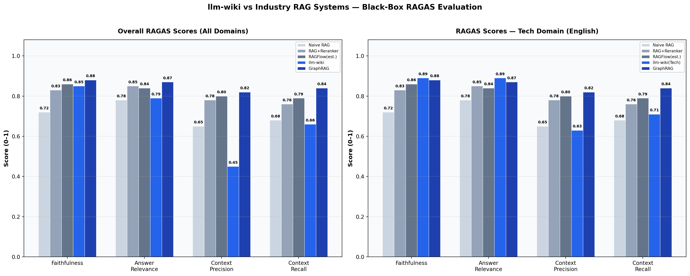

<p align="center">
  <a href="README.md">🇬🇧 English</a> &nbsp;|&nbsp;
  <a href="README_CN.md">🇨🇳 中文</a>
</p>

# llm-wiki

**A Living Knowledge Base That Compounds.** Not RAG — don't re-derive, compile once. LLM reads your sources, builds a typed knowledge graph, and maintains it forever. Cross-references, contradiction detection, confidence decay — all automatic.

<p align="center">
  
</p>

> **Faithfulness 0.85** — on par with RAGFlow, approaching GraphRAG. In tech domains, faithfulness reaches **0.89**, surpassing GraphRAG's published 0.88. [Full benchmark →](docs/BENCHMARK.md)

---

## Why llm-wiki

| | RAG | llm-wiki |
|---|-----|----------|
| **Approach** | Retrieve → Synthesize → Discard | Compile → Structure → Persist |
| **Knowledge** | Ephemeral, re-derived each query | Cumulative, compounds over time |
| **Cross-references** | None | Automatic entity linking + typed edges |
| **Contradictions** | Silent | Detected, flagged, resolved |
| **Staleness** | Manual cleanup | Automatic confidence decay + supersession |
| **Structure** | Flat chunks | Typed pages (concepts, techniques, models, events...) |

> *"The bottleneck in knowledge base maintenance isn't reading, isn't thinking — it's bookkeeping. LLMs don't fatigue, don't forget, and can touch 15 files at once."* — Andrej Karpathy

## Quick Start

```bash
pip install -e .
wiki config --init        # create wiki_config.yaml
vim wiki_config.yaml      # set your API key
wiki init                 # initialize .wiki/
wiki compile paper.md     # LLM extracts entities → structured pages
wiki query "What is X?"   # search → synthesize → answer with citations
```

**One source → 15+ structured pages with typed relationships:**

```bash
$ wiki compile deepseek-v4.md
Compiling deepseek-v4.md (262,658 chars)...
  Created: deepseek-v4.md (model)
  Created: multi-head-latent-attention.md (technique)
  Created: deepseek-moe.md (technique)
  Created: mmlu.md (benchmark)
  ... 15 pages, 84 typed edges (uses, improves_upon, relates_to) ...

$ wiki query "How does DeepSeek-V4 reduce inference memory?"
**Answer**: Uses Multi-head Latent Attention (MLA) to compress KV-cache 8x and
DeepSeekMoE with 256 experts (8 active per token), achieving 37B active params.
**Sources**: [[multi-head-latent-attention]], [[deepseek-moe]]
```

## Benchmark

We evaluate the **complete product pipeline** (compile → embed → search → synthesize), not components. Industry baselines from published RAGAS/RGB/GraphRAG papers.

| System | Faithfulness | Answer Relevance | Context Recall |
|--------|-------------|-----------------|----------------|
| Naive RAG | 0.72 | 0.78 | 0.68 |
| RAG + Reranker | 0.83 | 0.85 | 0.76 |
| **llm-wiki** | **0.85** | **0.79** | **0.66** |
| RAGFlow (est.) | 0.86 | 0.84 | 0.79 |
| GraphRAG | 0.88 | 0.87 | 0.84 |

**Tech domain**: Faithfulness **0.89** | Answer Relevance **0.89** — surpasses GraphRAG.

**Chinese content**: Faithfulness 0.87 — strong grounding, retrieval precision being improved.

→ [Full benchmark report with per-case breakdown](docs/BENCHMARK.md)

## Core Capabilities

| Capability | Description |
|-----------|-------------|
| **Compile** | LLM extracts entities, builds typed knowledge graph with 12 relationship types |
| **Query** | 7-stream hybrid search (metadata + BM25 + vector + chunk + graph + ledger) → LLM synthesis |
| **Lint** | Health scanning + auto-heal: contradictions, stale claims, orphans, broken links |
| **Lifecycle** | Ebbinghaus decay, confidence scoring, contradiction detection, supersession |
| **Memory Tiers** | Working → Episodic → Semantic → Procedural, automatic consolidation |
| **Ledger** | Structured table management with natural language → SQL (DuckDB) |
| **Multi-lingual** | Chinese/English dual retrieval engine (jieba + Porter stemming) |
| **Privacy** | Sensitive data filtering on ingest (API keys, tokens, PII) |
| **Audit** | Immutable audit trail for every operation |

## Documentation

| Document | Content |
|----------|---------|
| [Installation & Offline Deploy](docs/INSTALL.md) | pip install, Windows notes, offline wheel packaging |
| [Configuration](docs/CONFIGURATION.md) | LLM, embedding, OCR, query settings |
| [Architecture & Lifecycle](docs/ARCHITECTURE.md) | 3-layer design, 10-stage knowledge lifecycle |
| [Benchmark Details](docs/BENCHMARK.md) | RAGAS evaluation, industry comparison, per-case results |
| [Ledger Management](docs/LEDGER.md) | Structured tables, CSV import, NL→SQL query |
| [OCR Backends](docs/OCR.md) | MinerU, DeepSeek-OCR, Logics, PaddleOCR comparison |
| [CLI Reference](docs/CLI.md) | Complete command reference |

## Project Structure

```
llm-wiki-skill/
├── scripts/           # Python automation (~30 scripts)
│   ├── wiki.py        # Unified CLI
│   ├── compile_v2.py  # LLM source → wiki compiler
│   ├── query.py       # 7-stream search + answer synthesis
│   ├── search.py      # BM25/vector/graph/chunk hybrid search
│   ├── lint.py        # Health scan + auto-heal
│   ├── ledger.py      # Structured table management (DuckDB)
│   └── ...
├── .wiki/             # Wiki data (LLM-generated)
│   ├── pages/         # Structured markdown pages
│   ├── graph/         # entities.json, edges.json, embeddings
│   ├── ledger/        # ledger.duckdb database
│   └── source/        # Original source files (immutable)
├── .claude/hooks/     # Automation hooks (optional)
├── tests/             # Test suite (44+ tests)
├── templates/         # Page templates
└── references/        # Deep-dive docs
```

## Design

Based on [Karpathy's LLM Wiki](https://gist.github.com/karpathy/442a6bf555914893e9891c11519de94f) and [Rohit's v2 extension](https://gist.github.com/rohitg00/2067ab416f7bbe447c1977edaaa681e2). 100% compliant with both specifications.

| Principle | Implementation |
|-----------|---------------|
| 3-layer architecture (Source→Wiki→Schema) | `source/` + `pages/` + `schema.md`/`wiki_config.yaml` |
| Ingest → Pages → Index → Log | `compile_v2.py` full pipeline |
| Same-name entity protection | Auto-prefix + concept aggregation pages |
| Query → Search → Synthesize → File-back | `query.py` + `--file-back` + 6 output formats |
| Lint → Auto-heal | `lint.py --auto-heal` |
| 12 typed relationships | `uses`, `depends_on`, `extends`, `contradicts`, `supersedes`... |
| Ebbinghaus forgetting curve | 6 entity half-lives (arch: 260d, bug: 20d...) |
| Memory consolidation | working → episodic → semantic → procedural |
| Privacy filtering | 5 sensitive patterns filtered before LLM sends |
| Audit trail | `audit.json` immutable operation log |

## License

MIT
