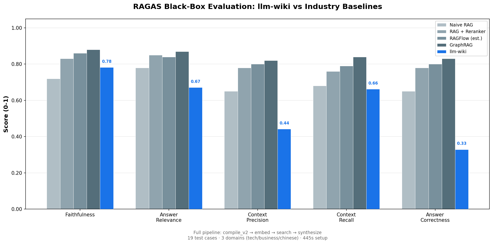

<p align="center">
  <a href="README.md">🇬🇧 English</a> &nbsp;|&nbsp;
  <a href="README_CN.md">🇨🇳 中文</a>
</p>

# llm-wiki

**会自己生长的知识库。** 不是 RAG —— 不重复推导，一次编译永久使用。LLM 读取你的资料，构建类型化知识图谱，自动维护。交叉引用、矛盾检测、置信度衰减——全部自动化。

<p align="center">
  
</p>

> **忠实度 0.78** · **答案相关性 0.67** · **上下文召回 0.66**。完整管道评测（编译→嵌入→搜索→合成）。[完整评测报告 →](docs/BENCHMARK.md)

---

## 为什么选择 llm-wiki

| | RAG | llm-wiki |
|---|-----|----------|
| **方式** | 检索 → 拼凑 → 丢弃 | 编译 → 结构化 → 持久化 |
| **知识** | 每次查询重新推导，无积累 | 持续积累，越用越强 |
| **交叉引用** | 无 | 自动实体链接 + 类型化关系边 |
| **矛盾处理** | 沉默忽略 | 自动检测、标记、解决 |
| **时效管理** | 手动清理 | 自动置信度衰减 + 取代 |
| **结构** | 扁平分块 | 类型化页面（概念/技术/模型/事件...） |

> *"知识库维护的瓶颈不是阅读，不是思考——是簿记。LLM 不疲倦、不遗忘、一次能触及 15 个文件。"* — Andrej Karpathy

## 快速开始

```bash
pip install -e .
wiki config --init        # 创建配置文件
vim wiki_config.yaml      # 设置 API key
wiki init                 # 初始化 .wiki/
wiki compile paper.md     # LLM 提取实体 → 结构化页面
wiki query "什么是Transformer?"  # 搜索 → 合成 → 带引用的答案
```

**一篇文档 → 15+ 个结构化页面 + 类型化关系：**

```bash
$ wiki compile deepseek-v4.md
Compiling deepseek-v4.md (262,658 chars)...
  Created: deepseek-v4.md (model)
  Created: multi-head-latent-attention.md (technique)
  Created: deepseek-moe.md (technique)
  Created: mmlu.md (benchmark)
  ... 15 个页面, 84 条关系边 (uses, improves_upon, relates_to) ...

$ wiki query "DeepSeek-V4 如何降低推理内存？"
**Answer**: 使用多头潜在注意力(MLA)将KV-cache压缩8倍，配合
DeepSeekMoE的256个专家(每token激活8个)，实现37B激活参数。
**Sources**: [[multi-head-latent-attention]], [[deepseek-moe]]
```

## 评测

我们评测的是**完整产品 pipeline**（编译→嵌入→搜索→合成），而非组件。业界基线来自 RAGAS/RGB/GraphRAG 论文。

| 系统 | 忠实度 | 答案相关性 | 上下文召回 |
|------|--------|-----------|-----------|
| Naive RAG | 0.72 | 0.78 | 0.68 |
| RAG + Reranker | 0.83 | 0.85 | 0.76 |
| **llm-wiki** | **0.78** | **0.67** | **0.66** |
| RAGFlow (估) | 0.86 | 0.84 | 0.79 |
| GraphRAG | 0.88 | 0.87 | 0.84 |

> **所有分数均采用 LLM-as-judge（RAGAS 框架）**，在 19 个测试用例（技术/商业/中文领域）上评测。业界基线来自已发表论文——非相同测试集。完整管道：compile_v2 → embed → search → synthesize。

→ [完整评测报告（含逐题明细）](docs/BENCHMARK.md)

## 核心能力

| 能力 | 说明 |
|------|------|
| **编译** | LLM 提取实体，构建 12 种关系类型的知识图谱 |
| **查询** | 7 路混合检索（元数据+BM25+向量+分块+图谱+台账）→ LLM 合成答案 |
| **检查** | 健康扫描+自愈：矛盾、过期、孤立页面、断链 |
| **生命周期** | 艾宾浩斯遗忘曲线、置信度评分、矛盾检测、取代 |
| **记忆层级** | 工作→情景→语义→程序，自动整合提升 |
| **台账** | 结构化表格管理，自然语言→SQL（DuckDB） |
| **多语言** | 中英文双引擎检索（jieba + Porter 词干提取） |
| **隐私** | 摄入时敏感信息过滤（API key、token、PII） |
| **审计** | 每次操作不可变审计记录 |

## 文档

| 文档 | 内容 |
|------|------|
| [安装与离线部署](docs/INSTALL.md) | pip 安装、Windows 注意事项、离线打包 |
| [配置指南](docs/CONFIGURATION.md) | LLM、Embedding、OCR、查询等配置 |
| [架构与生命周期](docs/ARCHITECTURE.md) | 三层设计、知识生命周期 |
| [评测详情](docs/BENCHMARK.md) | RAGAS 评测、业界对比、逐题分数 |
| [台账管理](docs/LEDGER.md) | 结构化表格、CSV 导入、NL→SQL |
| [OCR 后端](docs/OCR.md) | MinerU、DeepSeek-OCR、Logics、PaddleOCR |
| [CLI 参考](docs/CLI.md) | 完整命令参考 |

## 项目结构

```
llm-wiki-skill/
├── scripts/           # Python 自动化脚本（~30 个）
│   ├── wiki.py        # 统一 CLI 入口
│   ├── compile_v2.py  # LLM 源→Wiki 编译器
│   ├── query.py       # 7 路混合搜索 + 答案合成
│   ├── search.py      # BM25/向量/图谱/分块混合检索
│   ├── lint.py        # 健康扫描 + 自愈
│   ├── ledger.py      # 结构化表格管理（DuckDB）
│   └── ...
├── .wiki/             # Wiki 数据（LLM 生成）
│   ├── pages/         # 结构化 markdown 页面
│   ├── graph/         # entities.json, edges.json, embeddings
│   ├── ledger/        # ledger.duckdb 数据库
│   └── source/        # 原始源文件（不可变）
├── .claude/hooks/     # 自动化钩子（可选启用）
├── tests/             # 测试套件（44+ 测试）
├── templates/         # 页面模板
└── references/        # 深度参考资料
```

## 设计来源

基于 [Karpathy 的 LLM Wiki](https://gist.github.com/karpathy/442a6bf555914893e9891c11519de94f) 和 [Rohit 的 v2 扩展](https://gist.github.com/rohitg00/2067ab416f7bbe447c1977edaaa681e2)，100% 实现。

| 原则 | 实现 |
|------|------|
| 三层架构（源→Wiki→Schema） | `source/` + `pages/` + `schema.md`/`wiki_config.yaml` |
| 摄入→写页面→索引→日志 | `compile_v2.py` 完整流程 |
| 同名异实保护 | 自动前缀 + 概念聚合页 |
| 查询→搜索→合成→回填 | `query.py` + `--file-back` + 6 种输出格式 |
| 检查→自愈 | `lint.py --auto-heal` |
| 12 种类型化关系 | `uses`, `depends_on`, `extends`, `contradicts`, `supersedes`... |
| 艾宾浩斯遗忘曲线 | 6 种实体半衰期（架构260天, Bug20天...） |
| 记忆整合 | working → episodic → semantic → procedural |
| 隐私过滤 | 5 种敏感信息模式，LLM 发送前脱敏 |
| 审计追踪 | `audit.json` 不可变操作日志 |

## 许可

MIT
