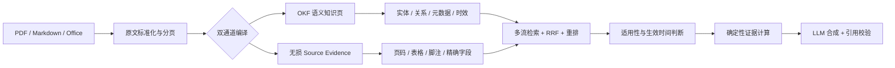

# Benchmark：llm-wiki 与 PageIndex 同物料对比

> 评测日期：2026-09-19 · 34 份 PDF · 1,945 页 · 62 道问题 · 0 运行错误

llm-wiki 在 [PageIndex OSS Benchmark](https://github.com/VectifyAI/PageIndex-OSS-Benchmark)
的同一批 PDF、问题和参考答案上，方向性准确率由 **38/62（61.3%）** 提升到
**62/62（100%）**。最终结果达到 PageIndex 已公布结果的最高档位。

<p align="center">
  
</p>

> [!IMPORTANT]
> 两边使用相同语料、问题、参考答案和语义等价判分 Prompt；但 llm-wiki 使用项目配置的
> 回答模型和 Judge，PageIndex 公布结果使用 OpenAI 模型与官方结构化 Judge。因此该结果
> 适合验证工程改进和能力上限，不应包装成严格的模型对模型排行榜胜负。

## 一页结论

| 指标 | llm-wiki 优化前 | llm-wiki 当前 | 变化 |
|---|---:|---:|---:|
| 语义等价答案 | 38/62 | **62/62** | **+24 题** |
| 方向性准确率 | 61.3% | **100.0%** | **+38.7 个百分点** |
| 错误答案 | 24 | **0** | **-100%** |
| 运行错误 | 0 | **0** | 持续为 0 |
| 平均查询延迟 | 2.91 秒 | **2.58 秒** | **-11.3%** |
| P95 查询延迟 | 5.59 秒 | **4.03 秒** | **-27.9%** |

当前结果与 PageIndex 的最强配置同为 **62/62**。相比 PageIndex 的
`gpt-5.6-luna/high`（60/62），方向性结果多答对 2 题；相比 PageIndex 的
`gpt-5.6-terra/high` 和 `gpt-5.6-sol/medium`，达到相同准确率上限。

## PageIndex 公布结果矩阵

PageIndex 使用同一棵由 `gpt-5.6-luna` 构建的索引树，更换回答模型和推理档位：

| 系统 | 回答模型 | 推理档位 | 正确数 | 准确率 | 平均回答成本/题 |
|---|---|---|---:|---:|---:|
| PageIndex | gpt-5.6-luna | none | 53/62 | 85.5% | $0.0031 |
| PageIndex | gpt-5.6-luna | low | 53/62 | 85.5% | $0.0033 |
| PageIndex | gpt-5.6-luna | medium | 57/62 | 91.9% | $0.0038 |
| PageIndex | gpt-5.6-luna | high | 60/62 | 96.8% | $0.0036 |
| PageIndex | gpt-5.6-terra | none | 56/62 | 90.3% | $0.0296 |
| PageIndex | gpt-5.6-terra | low | 59/62 | 95.2% | $0.0324 |
| PageIndex | gpt-5.6-terra | medium | 61/62 | 98.4% | $0.0303 |
| PageIndex | gpt-5.6-terra | high | **62/62** | **100.0%** | $0.0325 |
| PageIndex | gpt-5.6-sol | none | 60/62 | 96.8% | $0.0759 |
| PageIndex | gpt-5.6-sol | low | 60/62 | 96.8% | $0.0817 |
| PageIndex | gpt-5.6-sol | medium | **62/62** | **100.0%** | $0.0810 |
| PageIndex | gpt-5.6-sol | high | **62/62** | **100.0%** | $0.0819 |
| **llm-wiki** | 项目配置模型 | 配置 Judge | **62/62** | **100.0%*** | 未标准化 |

`*` llm-wiki 行为方向性结果；成本没有按 PageIndex 的 LiteLLM 口径计量，不能直接比较。

## llm-wiki 的提升过程

| 阶段 | 正确数 | 准确率 | 关键变化 |
|---|---:|---:|---|
| 编译 Wiki 基线 | 38/62 | 61.3% | 仅依赖编译后的知识页，细粒度事实容易丢失 |
| 无损原文证据 | 46/62 | 74.2% | 按页保存原文、表格、脚注和精确字段 |
| 检索与上下文调优 | 55/62 | 88.7% | Raw 检索流、相邻页、结构路由、融合保底 |
| 确定性证据 | **62/62** | **100.0%** | 年份映射、步骤、脚注、净额、计数等精确计算 |

这条曲线说明，主要瓶颈不是 LLM “不会回答”，而是原始事实是否完整保存、是否被稳定召回、
以及能否避免模型把总额、净额、脚注对象或未来生效规则混为一谈。

## 架构亮点



### 1. 语义层与证据层并存

- **OKF 语义层**负责概念、实体、关系、政策状态、适用范围和跨文档连接。
- **无损证据层**保留清洗后的完整原文、页码、表格、脚注和精确字段。
- 编译成功前执行 SHA-256 覆盖门禁，防止“知识页生成成功但原文事实丢失”。

这解决了传统“摘要式编译”的根本缺陷：摘要适合理解，但不适合回答电话号码、金额、页码、
脚注案例、表格单元格等精确问题。

### 2. 多路检索，而不是单一向量相似度

默认检索流包括：

```text
raw + claim + metadata + BM25 + graph + ledger
                 ↓
        weighted RRF + rerank
                 ↓
      coverage-diverse top evidence
```

Raw 流提供逐页事实；Claim 流提供原子主张；Metadata 和 Graph 提供结构、别名与关系；
Ledger 处理结构化记录。带确定性答案的原始证据会被优先保留，避免在融合和重排时被概念页挤掉。

### 3. 正确处理政策时效性

查询“当前政策”时，系统不会简单选择日期最新的文件：

- 已发布但尚未生效的新规不会提前覆盖现行规则。
- 已废止或被替代的历史规则不会作为当前答案。
- “截至某日”查询会按目标日期重建当时有效的规则集合。
- 生效日、失效日、替代关系、适用对象和司法辖区共同参与排序。
- 证据存在冲突时保留来源权威性和时间依据，而不是静默覆盖。

### 4. 对高风险精确问题使用确定性证据

| 失败模式 | 通用修复机制 | Benchmark 示例 |
|---|---|---|
| 跨页步骤漏计 | 邻页证据 + 编号步骤计数 | Down Button 为 2 步 |
| 双栏 PDF 断句 | 跨栏噪声容忍 + 定义短语重建 | conscious incompetence 条件 |
| 方法名与描述分离 | 方法名—定义同窗抽取 | PKG |
| 年份与金额成对出现 | 年份—数值按顺序映射 | Gift card liability = 3.0B |
| 总额与净额混淆 | 明确指标和日期的确定性映射 | Goodwill = 1,383M |
| 脚注主体误判 | 命题附近脚注解析 | Wong v. Allison |
| OCR 拼写和断词 | 文档词表模糊纠错 | advertsing / Neflix |
| 语义单元误作页码 | Unit、Section 与物理页分离 | Unit 8 / Unit 14 |

### 5. 可验证、可复现、可回退

- 每次运行记录数据集哈希、Git revision、模型、查询配置和语料指纹。
- 每题保留回答、召回来源、查询耗时、引用验证和错误状态。
- Benchmark 不丢弃失败问题，运行错误同样计入结果。
- 原文证据可从回答引用直接回到 PDF 页级定位。
- 编译缓存与查询重跑分离，能快速验证检索改动而不重复支付编译成本。

## 分文档类型结果

| 文档类型 | 问题数 | 正确数 | 准确率 |
|---|---:|---:|---:|
| 学术论文 | 7 | 7 | 100.0% |
| 行政/行业文件 | 20 | 20 | 100.0% |
| 宣传册 | 5 | 5 | 100.0% |
| 财务报告 | 14 | 14 | 100.0% |
| 指南/手册 | 10 | 10 | 100.0% |
| 研究报告/介绍材料 | 6 | 6 | 100.0% |

结果覆盖学术论文、法律案例、行政报告、产品手册、课程材料和上市公司 10-K，说明改进并非只针对
某一种文档结构。

## 性能与成本边界

| 指标 | 结果 |
|---|---:|
| 首次编译总时间 | 5,211.30 秒 |
| 平均首次编译时间 | 153.27 秒/PDF |
| 编译生成知识页 | 1,204 页 |
| 平均查询延迟 | 2.58 秒 |
| P50 查询延迟 | 2.14 秒 |
| P95 查询延迟 | 4.03 秒 |
| 查询运行错误 | 0 |

首次编译是一次性成本；后续查询和 Benchmark 重跑复用已编译 Wiki 与原文证据。PageIndex 公布的
`results.json` 提供回答调用成本，但没有提供与本次相同口径的端到端查询延迟，因此本文不做速度
胜负结论。

## 评测协议

固定版本：

| 项目 | 固定值 |
|---|---|
| PageIndex Benchmark commit | `ad4c0b92970a6f4801f09ff2e647389e8f5874fa` |
| MMLongBench-Doc-V2 commit | `3aba3c6831a432ee882f763435f9ebe92ab75ed9` |
| PDF 数量 | 34 |
| PDF 总页数 | 1,945 |
| 问题数量 | 62 |
| Judge Prompt | 固定仓库 `eval/judge.py` 中的原始 Prompt |

保留的 PageIndex 关键约束：

1. 每道题只能访问它所属的单份 PDF，不允许跨文档污染。
2. 使用相同的 `question`、`answer`、`answer_format` 和 `response` 结构。
3. 使用 MMLongBench-Doc-V2 的语义等价判分标准。
4. 62 道问题全部计分，超时、异常和空回答不得跳过。
5. 记录语料和配置指纹，避免不同数据或配置的分数被混在一起。

## 复现命令

```bash
# 首次运行：逐 PDF 编译并查询
python scripts/benchmark_pageindex.py run /path/to/PageIndex-OSS-Benchmark \
  --output evals/pageindex_oss_results/predictions.json

# 复用编译缓存，只重跑检索与回答
python scripts/benchmark_pageindex.py rerun-queries \
  /path/to/PageIndex-OSS-Benchmark \
  evals/pageindex_oss_results/predictions.json \
  --output evals/pageindex_oss_results/predictions-rerun.json

# 使用固定的官方 Prompt 做方向性 Judge
python scripts/benchmark_pageindex.py judge-configured \
  evals/pageindex_oss_results/predictions-rerun.json \
  --official-judge-file /path/to/MMLongBench-Doc-V2/eval/judge.py

# 生成汇总报告
python scripts/benchmark_pageindex.py report \
  evals/pageindex_oss_results/predictions-rerun.configured-judged.json

# 重绘文档中的对比图
python scripts/gen_chart.py
```

## 质量门禁

本轮实现通过以下本地质量门禁：

- `ruff check scripts tests`：全仓 0 问题。
- `python -m compileall -q scripts tests`：全部可编译。
- `pytest -q`：**393 passed**，完整测试集通过。
- Skill quick validator：目录、Frontmatter 和资源结构有效。
- 发布包执行敏感信息扫描、ZIP 完整性检查和解包后二次校验。

## 如何解读这份结果

可以得出的结论：

- 无损证据和多路检索显著解决了编译型知识库的细粒度事实丢失问题。
- llm-wiki 已在这组固定材料上达到 62/62 的能力上限。
- 优化同时降低了平均和 P95 查询延迟，没有用更多错误换取准确率。
- 同一架构能够处理法律脚注、财务表格、手册步骤、学术定义和政策时效。

不能直接得出的结论：

- 不能因为方向性 100% 就宣称所有模型配置下严格优于 PageIndex。
- 不能把 62 题结果外推为对所有 PDF、OCR 质量和业务领域都达到 100%。
- 不能把 PageIndex 的回答成本与 llm-wiki 的端到端成本直接比较。

最稳妥的表述是：**在相同 62 道问题上，llm-wiki 的最终方向性结果达到 PageIndex 公布矩阵的
最高准确率档位；工程改进将自身基线提高了 38.7 个百分点。**
