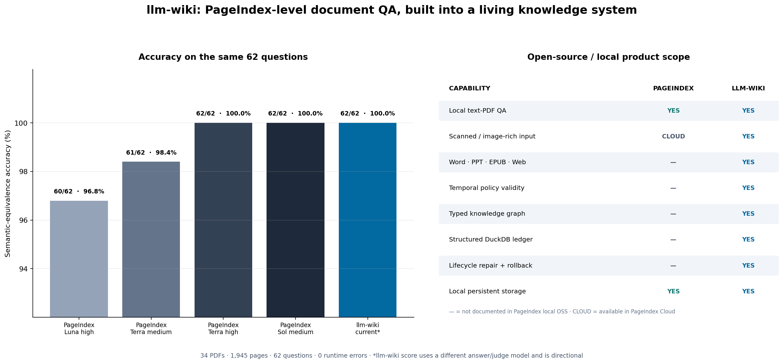
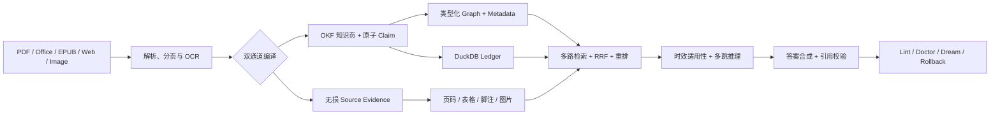

# Benchmark：PageIndex 级文档问答，面向长期知识管理

> 34 份 PDF · 1,945 页 · 62 道问题 · **62/62** · 0 运行错误

llm-wiki 在 [PageIndex OSS Benchmark](https://github.com/VectifyAI/PageIndex-OSS-Benchmark)
的同一批文档、问题和参考答案上取得 **100% 方向性准确率**。它的价值不止是回答一份长
PDF：同一套系统还把原始资料编译成可追溯、可更新、可处理政策时效的长期知识库。

<p align="center">
  
</p>

> [!IMPORTANT]
> llm-wiki 与 PageIndex 使用相同语料、问题、参考答案及语义等价 Judge Prompt，但回答模型和
> Judge 模型不同。因此 **62/62 是同物料方向性结果**，证明系统已达到这组材料的准确率上限，
> 不代表严格的同模型排行榜胜负。

## 核心结果

| 指标 | llm-wiki 当前结果 |
|---|---:|
| 语义等价答案 | **62/62** |
| 方向性准确率 | **100.0%** |
| 查询运行错误 | **0** |
| 平均查询延迟 | **2.58 秒** |
| P50 / P95 查询延迟 | **2.14 / 4.03 秒** |
| 首次编译产物 | **1,204 个知识页** |

评测覆盖学术论文、法律案例、行政报告、产品手册、课程材料、研究报告和上市公司 10-K。
系统不仅能定位相关章节，还能稳定处理脚注主体、跨页步骤、年份—金额映射、净额/总额区分、
OCR 拼写噪声等高精度问题。

## 与 PageIndex 公布结果对比

PageIndex 在相同 62 道问题上公布了不同回答模型和推理档位的结果。下表保留其代表性配置，
完整原始矩阵可在固定版本的 `results.json` 中核验。

| 系统 / 配置 | 正确数 | 准确率 | 回答成本/题 |
|---|---:|---:|---:|
| PageIndex · gpt-5.6-luna/high | 60/62 | 96.8% | $0.0036 |
| PageIndex · gpt-5.6-terra/medium | 61/62 | 98.4% | $0.0303 |
| PageIndex · gpt-5.6-terra/high | **62/62** | **100.0%** | $0.0325 |
| PageIndex · gpt-5.6-sol/medium | **62/62** | **100.0%** | $0.0810 |
| **llm-wiki · 当前方向性结果** | **62/62** | **100.0%*** | 未按同口径计量 |

`*` llm-wiki 达到 PageIndex 公布矩阵的最高准确率档位；由于模型和 Judge 配置不同，不把该行
表述为严格领先。PageIndex 成本来自其发布结果，llm-wiki 没有使用相同 LiteLLM 计费口径。

## 同样答对 62 题，产品价值有什么不同

PageIndex 的核心优势是用层级树和 LLM 推理完成长文档检索。llm-wiki 面向的是更宽的目标：
把 PDF 问答能力放进一个能够持续摄入、关联、校验和演化的本地知识系统。

以下比较限定为 **PageIndex 开源本地模式** 与 **llm-wiki 本地模式**。PageIndex Cloud 另有
OCR、图像理解、Metadata、Folders 和 MCP 等托管能力；PageIndex 信息以其
[官方 README](https://github.com/VectifyAI/PageIndex/blob/main/README.md) 为准。

| 能力 | PageIndex 开源本地模式 | llm-wiki |
|---|---|---|
| 产品定位 | 长文档检索与问答 | 持续生长的个人/团队知识库 |
| 本地文本 PDF | 支持 | 支持 |
| 扫描件、图片型文档 | 本地模式未提供；Cloud 支持 | 本地多 OCR 后端 |
| 输入类型 | 文本 PDF | PDF、Word、PPT、EPUB、Markdown、网页、图片 |
| 知识结构 | 文档层级树 | OKF 页面、原子 Claim、类型化知识图谱、无损原文证据 |
| 检索方式 | LLM 在层级树上推理 | Raw、Claim、Metadata、BM25F、Graph、Ledger、可选 Vector 融合 |
| 政策时效 | 官方本地能力未说明 | 生效、失效、取代、适用范围与 `as-of` 查询 |
| 结构化数据 | 官方本地能力未说明 | DuckDB 全字段台账与自然语言查询 |
| 生命周期维护 | 官方本地能力未说明 | Lint、Doctor、Dream、冲突检测、质量门禁、Git 回滚 |
| 本地持久化 | 支持 | 支持 |
| 引用定位 | 本地模式页级引用 | 页、幻灯片、EPUB section、知识页和原子 Claim |

这不是在否定 PageIndex 的树检索路线。两者解决的问题不同：PageIndex 聚焦“如何读懂并检索长
文档”，llm-wiki 进一步解决“如何让多来源知识长期保持完整、有效、可追溯”。

## 项目亮点

### 1. 语义知识与原始证据双层保真

- **OKF 语义层**保存实体、关系、适用范围、政策状态和跨文档连接。
- **无损证据层**保存完整原文、页码、表格、脚注、图片引用和精确字段。
- 编译完成前执行来源覆盖门禁，避免“摘要生成成功，但电话号码、金额或脚注已经丢失”。

语义层负责理解，证据层负责精确回答；二者不再互相取代。

### 2. 多路检索保留不同类型的相关性

```text
raw + claim + metadata + BM25F + graph + ledger + optional vector
                               ↓
                    weighted RRF + rerank
                               ↓
              coverage-diverse, citation-ready evidence
```

原文流寻找页级事实，Claim 流寻找原子主张，Metadata 和 Graph 处理别名、结构与关系，Ledger
查询完整结构化记录。精确证据不会因为语义页面得分更高而在融合阶段被挤掉。

### 3. 时间不是过滤条件，而是答案语义

面对“当前执行什么政策”或“截至某日适用哪项规定”，系统同时判断：

- 发布日期与实际生效日期；
- 失效、废止和被取代关系；
- 适用对象、地域和制度范围；
- 查询目标时间，而不只是系统当前时间；
- 来源权威性以及冲突证据。

因此，已经发布但尚未生效的新规不会提前覆盖现行规则；历史时点查询也不会被今天的规则污染。

### 4. 不只是检索，还能维护知识质量

- `wiki lint` 检查断链、孤立实体、元数据、矛盾和过期信息。
- `wiki doctor` 根据用户反馈定位来源并执行可验证修复。
- `wiki dream` 从查询行为中维护页面，带质量门禁和自动回滚。
- 来源哈希、运行 manifest、引用定位和本地 Git 快照让修改可审计、可恢复。

## 端到端架构



## 分文档类型结果

| 文档类型 | 问题数 | 正确数 | 准确率 |
|---|---:|---:|---:|
| 学术论文 | 7 | 7 | 100.0% |
| 行政/行业文件 | 20 | 20 | 100.0% |
| 宣传册 | 5 | 5 | 100.0% |
| 财务报告 | 14 | 14 | 100.0% |
| 指南/手册 | 10 | 10 | 100.0% |
| 研究报告/介绍材料 | 6 | 6 | 100.0% |

## 适合的场景

- **政策与合规知识库**：区分发布、生效、废止和历史适用状态。
- **研究与专业资料库**：跨论文、报告和手册建立实体关系，保留页级出处。
- **财务与运营资料**：同时查询叙述性知识和 DuckDB 结构化台账。
- **扫描档案与复杂文档**：公式、表格、多栏、图片型 PDF 可通过本地 OCR 进入同一知识层。
- **长期 Agent Memory**：知识不是一次性上下文，而是可检查、可修复、可演化的持久资产。

## 可复现评测协议

| 项目 | 固定值 |
|---|---|
| PageIndex Benchmark commit | `ad4c0b92970a6f4801f09ff2e647389e8f5874fa` |
| MMLongBench-Doc-V2 commit | `3aba3c6831a432ee882f763435f9ebe92ab75ed9` |
| PDF / 页数 / 问题 | 34 / 1,945 / 62 |
| Judge Prompt | 固定仓库 `eval/judge.py` 的原始 Prompt |
| 问题集 SHA-256 | `f0cc046c0e3bdd4c8c4a4dc977e08e107d21d6a2d22fb8237914111d0f6e256e` |
| PDF 语料指纹 | `a0ed377618ed48a6753d959062fd24cca3d1e607f5f490767ff510b57480a833` |

评测遵守以下约束：每题只能访问指定 PDF；62 题全部计分；空回答、异常和超时不得跳过；输出
保留官方兼容的 `question`、`answer`、`answer_format` 和 `response` 字段；运行记录包含语料、
模型、配置及 Git revision 指纹。

```bash
# 编译 34 份 PDF 并运行全部问题
python scripts/benchmark_pageindex.py run /path/to/PageIndex-OSS-Benchmark \
  --output evals/pageindex_oss_results/predictions.json

# 使用固定官方 Prompt 和当前配置的 Judge 生成方向性结果
python scripts/benchmark_pageindex.py judge-configured \
  evals/pageindex_oss_results/predictions.json \
  --official-judge-file /path/to/MMLongBench-Doc-V2/eval/judge.py

# 输出汇总报告
python scripts/benchmark_pageindex.py report \
  evals/pageindex_oss_results/predictions.configured-judged.json
```

逐题回答、判定、运行 manifest 和文档类型报告均保存在
[`evals/pageindex_oss_results/`](../evals/pageindex_oss_results/)。Benchmark runner 会拒绝问题集、
文档清单或 PDF 指纹不一致的输入。

## 质量门禁

- `ruff check scripts tests`：0 问题。
- `python -m compileall -q scripts tests`：全部可编译。
- `pytest -q`：**393 passed**。
- Skill quick validator：目录、Frontmatter 和资源结构有效。
- 发布包通过敏感信息与 ZIP 完整性检查。

## 结论

这份 Benchmark 支持两个明确结论：

1. llm-wiki 在 PageIndex 的同物料 62 题上达到 **62/62** 的方向性准确率上限。
2. 在文档问答之外，llm-wiki 还提供多格式本地摄入、无损证据、知识图谱、时效推理、结构化
   台账和生命周期维护，适合构建真正会长期生长的知识系统。

它不支持“所有文档都能达到 100%”或“严格同模型领先 PageIndex”的外推；项目价值来自准确率、
证据完整性和长期知识治理能力的组合。
