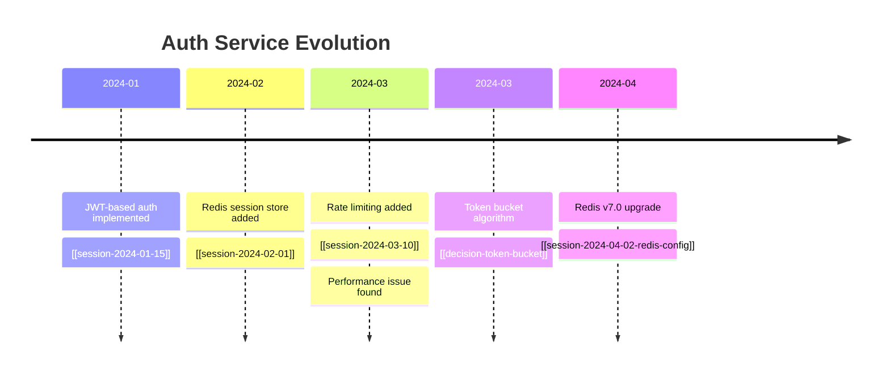
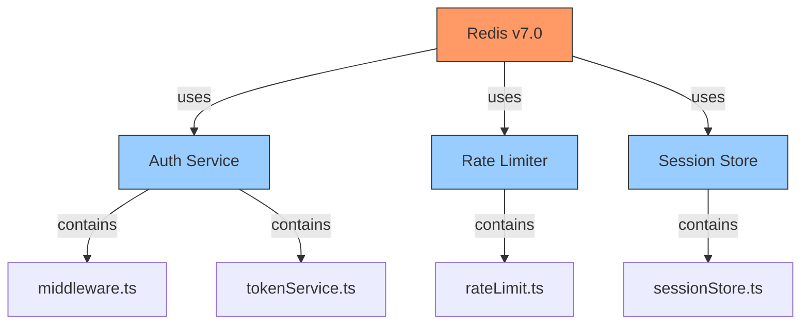

# Output Formats

The wiki is the knowledge store. The output format depends on the audience and the
question. Not every answer belongs in a markdown page.

## Format Selection Guide

When presenting wiki knowledge to the user, choose the format that best serves the query:

| Query Type | Best Format | Why |
|-----------|-------------|-----|
| "What is X?" | Markdown page / summary | Standard knowledge retrieval |
| "Compare X and Y" | Comparison table | Side-by-side comparison makes differences visible |
| "How has X evolved?" | Timeline | Chronological view of changes and decisions |
| "What depends on X?" | Dependency graph (Mermaid) | Visual structure shows relationships |
| "Present findings on X" | Slide deck (Marp) | Presentation format for sharing |
| "Export data about X" | CSV / JSON | Further analysis in other tools |
| "What's the state of X?" | Dashboard / status table | Overview at a glance |
| "Brief the team on X" | Executive summary | Condensed format for busy readers |
| "What patterns exist in X?" | Pattern catalog | Structured listing of recurring patterns |
| "What's the impact of changing X?" | Impact analysis report | Structured risk/benefit assessment |

## Format Implementations

### Comparison Table

When the user asks to compare entities, concepts, or decisions:

```markdown
## Comparison: Redis vs. Memcached for Session Storage

| Criterion | Redis | Memcached | Winner |
|-----------|-------|-----------|--------|
| Persistence | ✅ Snapshot + AOF | ❌ In-memory only | Redis |
| Data structures | ✅ Strings, hashes, lists, sets | ⚠️ Strings only | Redis |
| Clustering | ✅ Redis Cluster | ⚠️ Client-side only | Redis |
| Simplicity | ⚠️ Moderate complexity | ✅ Very simple | Memcached |
| Memory efficiency | ⚠️ More overhead | ✅ Less overhead | Memcached |
| Current usage in team | ✅ Used in 3 services | ❌ Not used | Redis |

**Recommendation**: Redis. Despite higher complexity, the team already uses it,
and the persistence and data structure features outweigh the simplicity of Memcached.
Confidence: 0.85, based on [[redis-caching]] (3 sources), [[memcached-evaluation]]
(1 source).
```

### Timeline

When showing the evolution of a decision, project, or entity:

```markdown
## Auth Service — Evolution Timeline



### Dependency Graph

When showing relationships and impact:



### Slide Deck (Marp)

When presenting findings (uses Marp for markdown-to-slides):

```markdown
---
marp: true
theme: default
---

# Auth Service Architecture Review
## April 2024

---

## Current State
- JWT-based authentication
- Redis v7.0 for session caching
- Token bucket rate limiting

---

## Key Findings
1. Redis is at correct version ✅
2. Rate limiting works at expected scale ✅
3. Session token rotation needs improvement ⚠️

---

## Recommendations
- Implement token rotation (Priority: High)
- Add Redis connection pooling (Priority: Medium)
- Document failover behavior (Priority: Medium)
```

### Structured Data Export

When the user needs data for analysis in other tools:

**JSON Export:**
```json
{
  "entities": [
    {
      "id": "redis-caching",
      "type": "library",
      "name": "Redis",
      "version": "7.0",
      "used_by": ["auth-service", "rate-limiter", "session-store"],
      "confidence": 0.9
    }
  ],
  "edges": [
    {
      "source": "auth-service",
      "target": "redis-caching",
      "type": "uses",
      "confidence": 0.85
    }
  ]
}
```

**CSV Export:**
```csv
entity_id,type,name,version,used_by_count,confidence
redis-caching,library,Redis,7.0,3,0.9
auth-service,project,Auth Service,,0,0.85
```

### Executive Summary / Brief

When briefing someone who needs the condensed version:

```markdown
# Auth Service — Brief

**tl;dr**: Auth service is healthy. Redis v7.0 confirmed. One action item:
implement session token rotation.

**Current State**: JWT auth with Redis-backed sessions. Rate limiting active.
All dependencies at current versions.

**Risks**: Session tokens don't rotate, creating a long-lived token vulnerability.
Mitigation: implement token rotation (estimated 2 days).

**Dependencies**: auth-service depends on Redis. Any Redis downtime = auth failure.
Current uptime: 99.9%. Failover documented but untested.

**Next Steps**:
1. Implement token rotation (High priority)
2. Test Redis failover (Medium priority)
3. Document deployment process (Medium priority)

*Condensed from [[auth-service]] entity page and [[session-2024-04-02-redis-config]].*
```

## Format Selection Logic

When choosing how to present results:

1. **Is the user asking for a specific format?** → Use that format
2. **Is the query comparative?** → Comparison table
3. **Is the query about change over time?** → Timeline
4. **Is the query about relationships/dependencies?** → Dependency graph
5. **Is the query for presentation/sharing?** → Slide deck or brief
6. **Is the query for further analysis?** → Structured data export
7. **Default**: Markdown summary with inline tables and diagrams as appropriate

## Generating Visualizations

### Mermaid Diagrams

Mermaid is the default for graphs and timelines because:
- Renders natively in GitHub, GitLab, Obsidian, and many markdown viewers
- Text-based, easy for LLMs to generate
- Supports: flowcharts, sequence diagrams, class diagrams, state diagrams, Gantt charts,
  pie charts, timelines, mindmaps

### Fallback: ASCII Art

When Mermaid rendering isn't available, fall back to ASCII:

```
auth-service
  ├── uses → Redis (v7.0)
  │     ├── for: session caching
  │     └── for: rate limiting
  ├── contains → middleware.ts
  ├── contains → tokenService.ts
  └── owned_by → Sarah Chen
```

### When NOT to Visualize

Skip visualizations when:
- The wiki has fewer than 5 entities (too sparse for meaningful graphs)
- The query is about a single entity with no relationships
- The user explicitly wants text-only output
- The visualization would be too complex (>20 nodes in a graph becomes unreadable)
